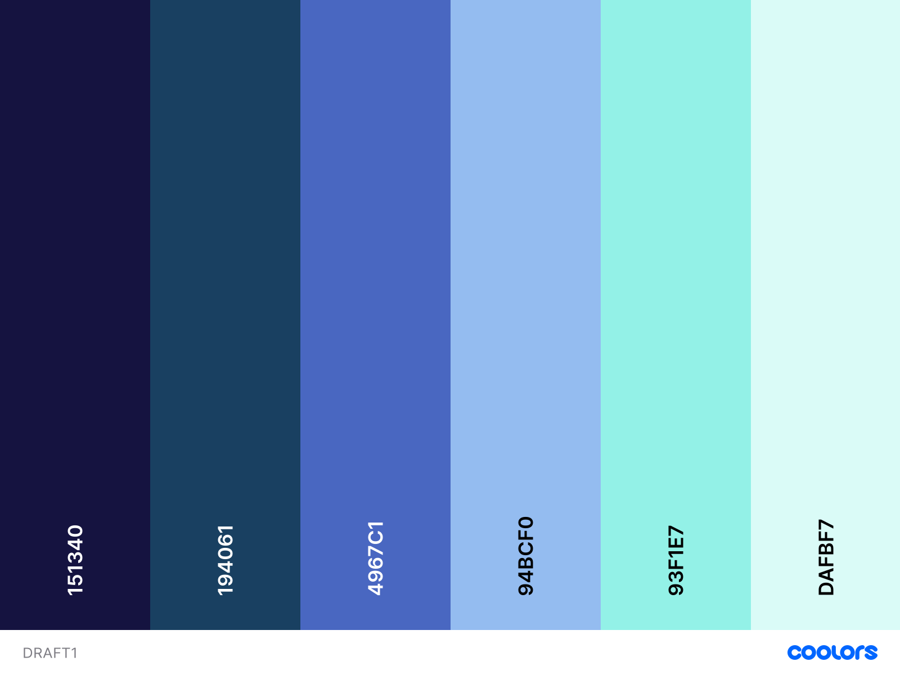

# Color-Scheme design Draft1 (2021/5/31)



inspired by [noctchill](https://www.google.com/url?sa=t&rct=j&q=&esrc=s&source=web&cd=&cad=rja&uact=8&ved=2ahUKEwi917rrq_PwAhXk_2EKHXayDZsQFnoECA0QAA&url=https%3A%2F%2Fshinycolors.idolmaster.jp%2Fidol%2Fnoctchill%2F&usg=AOvVaw2E7sGa_gIpGm-IIp9EWqXM)

```js
{
  "Russian Violet":"151340",
  "Indigo Dye":"194061",
  "Han Blue":"4967c1",
  "Baby Blue Eyes":"94bcf0",
  "Middle Blue Green":"93f1e7",
  "Light Cyan":"dafbf7"
}
```

感想： UI 用としては彩度高そう、まとまりがなさそう
