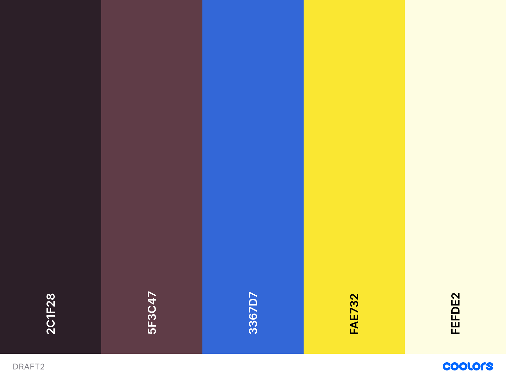

# Color-Scheme design Draft2 (2021/5/31)



inspired by ギンコ･ビローバ[(樋口円香)](https://shinycolors.idolmaster.jp/idol/noctchill/madoka.html)

```js
{
  "Raisin Black":"2c1f28",
  "Eggplant":"5f3c47",
  "Royal Blue Light":"3367d7",
  "Middle Yellow":"fae732",
  "Light Yellow":"fefde2"
}
```

感想： プライマリカラー,セカンダリカラー,暗め,暗い,白がそろっていてなかなかいいなと思いました そこまで好みという配色でもないですが
