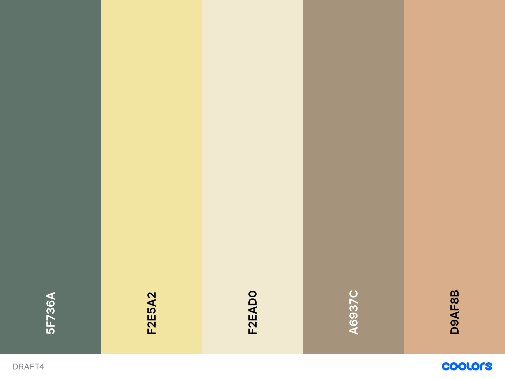

# Color-Scheme design Draft4 (2021/5/31)



inspired by [my drawing](./wall.png)

```js
{
  "Xanadu":"5f736a",
  "Medium Champagne":"f2e5a2",
  "Cornsilk":"f2ead0",
  "Grullo":"a6937c",
  "Tumbleweed":"d9af8b"
}
```

感想： 柔らかさがいい感じ ライトテーマっぽい